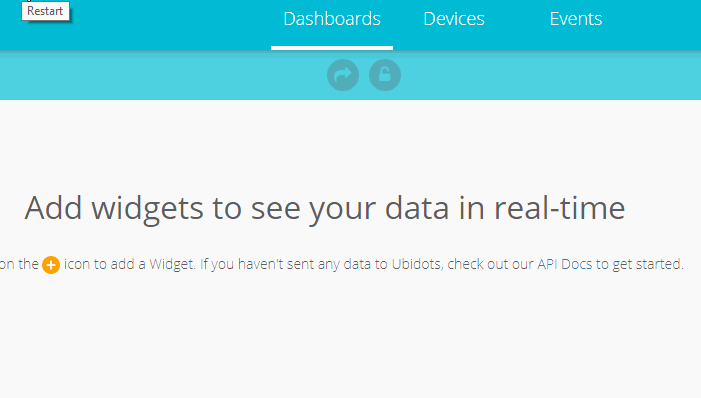
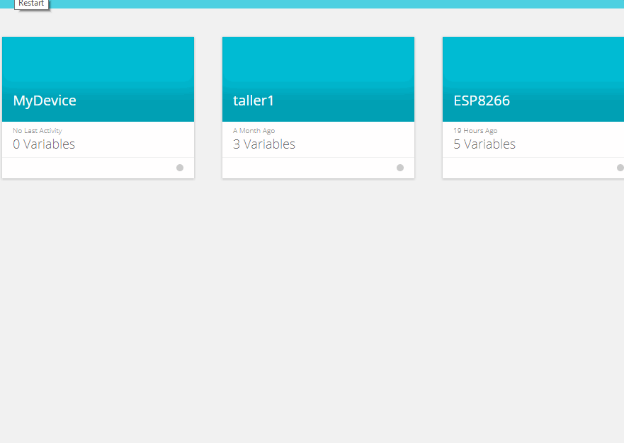
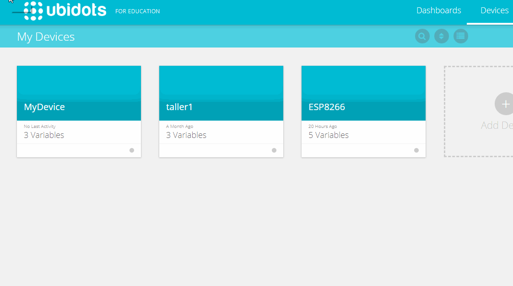
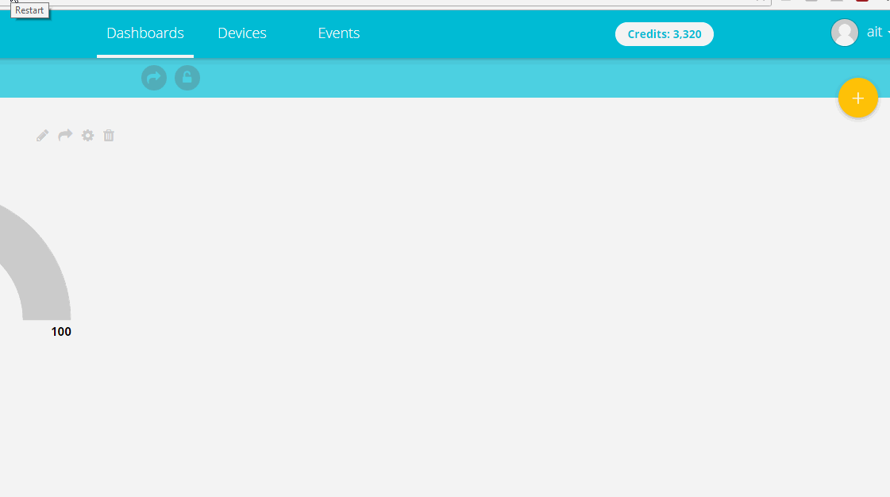
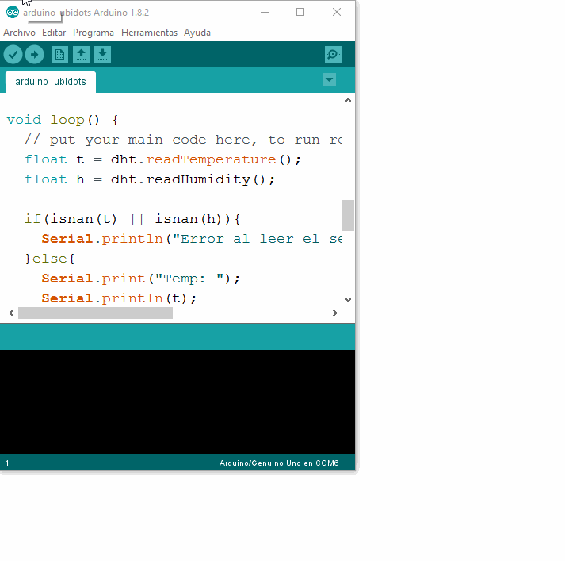
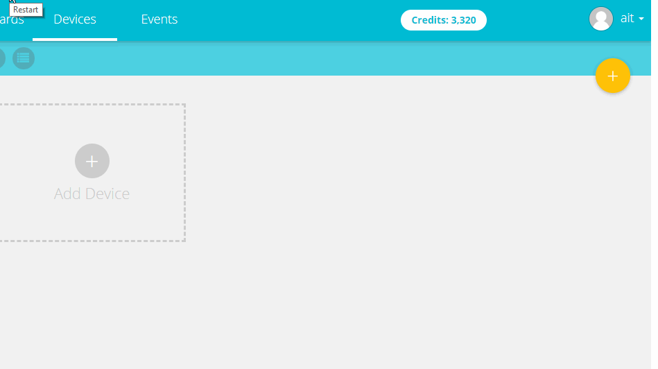

# Taller ArduinoEsp8266 y Ubidots

## instrucciones

### Creación cuenta en Ubidots
1. Ingrese a la página de uBidots [app.ubidots.com](https://app.ubidots.com) y registrese (pestaña SING UP).
2. En la pagina de uBidots, seleccione la pestaña "Device" y luego haga click en "Add Device" como se muestra en la siguiente figura.

Luego asigne un nombre representativo al nuevo dispositivo. Esto creará una representación de nuestra tarjeta Esp8266 en nuestra cuenta de uBidots.

3. A continuación haga click en el dispositivo recien creado y agregue una variable mediante un click en "Add Variable", seleccione la opción "Default" y nombrela como "temperatura".

4. Genere otra variable llamada "humedad".
5. Por último, cree una tercera variable llamada "led".

6. A continuación en la pestaña llamada "Dashboards", agregue un nuevo dashboard para su dispositivo, esto le permitirá visualizar y controlar los valores de sus variables. Cree un nuevo Dashboard, nombrelo adecudamente y luego haga click en él como se muestra en la figura.

7. Luego cree un "Widget" que nos permita observar la variable temeratura, para ello haga click en el icono , luego haga click en el tipo de indicador llamado "indicator" , luego seleccione el tipo de indicador llamado "Gauge" y a continuación seleccione el dispositivo anteriormente creado, finalmente seleccione la variable temperatura del dispositivo e indique los valores máximos y mínimos permitidos, en este caso seleccione -10 y 45 (estos serán los límites en grados celsius). En la siguiente figura se muestra el procedimiento.

8. De la misma forma, cree un widget para la variable humedad, con límites entre 0 y 100.

9. Finalmente cree otro widget del tipo switch para controlar la variable led. Haga clic en el icono , luego seleccione la clase de widget llamada "Control", a continuacion seleccione el tipo de widget llamado "switch" y luego elija el dispositivo anteriomente creado, seleccione la variable y haga click en el boton "finish".

## Cableado y Programación de la tarjeta ESP8266

1. Arme el circuito de la siguiente figura para conectar el sensor de temperatura y humedad a la tarjeta.

2. Conecte la tarjeta ESP8266 a su computador mediante un cable micro usb, deberá observar que el led del sensor se encienda inmediatamente, si esto no sucede, desconecte de inmediato y revise sus conexiones. Luego mueva el interruptor de la tarjeta a la posición "ON".

3. Abrir el programa IDE de Arduino y configurarlo para la tarjeta utilizada, primero en el menu seleccione Herramientas->Placa->"sparkFun ESP8266 Thing Dev", luego seleccionar el puerto de comunicaciones en Herramientas->puerto->comX (la X es reemplazada según el número que aparesca en cada computador).

4. Luego, cargue el archivo `arduino_ubidots.ino` mediante el menu Archivo->abrir...

5. Modifique el programa con los datos necesarios para la conexión WiFi. Modifique las lineas de código al comienzo del archivo: `#define WIFISSID "essid"` reemplazando la palabra essid por el nombre de su red, también modifique la línea `#define PASSWORD "passwd"` reemplazando passwd por la clave de la red.

6. Para que nuestra tarjeta pueda enviar y recibir datos desde las variables en uBidots, es necesario que se obtengan las ID's de cada variable. Para ello dentro de la cuenta de ubidots seleccione la pestaña "Devices" y luego su dispositivo, finalmente seleccione la variable deseada y la id de esta aparecerá en la ficha de la esquina izquierda, guarde esta id. En la siguiente figura de ejemplifica el procedimiento con la variable temperatura.

9. También es necesario obtener el token de usuario de ubidots, para ello haga click en el usuario en la esquina superior derecha y luego "Api Credentials", seleccione en la sección "Tokens" un token, por ejemplo el llamado "Default token" y guarde este código. En la siguiente figura se ejemplifica este procedimeinto.

7. en el archivo `arduino_ubidots.ino`, modifique las siguientes líneas al inicio del archivo:
`#define TOKEN  ""`, pegue entre las comillas el token de usuario de ubidots, en `#define ID_T ""` pegue entre las comillas el id de la variable temperatura, en `#define ID_H ""` pegue entre las comillas el id de la variable humedad y finalmente en `#define ID_SL ""` pegue el id de la variable led.

8. Presione el botón  del Ide de Arduino para compliar el programa y cargarlo a la tarjeta, esto tomará un poco de tiempo. Si todo ha salido bien, usted podrá ver los niveles de temperatura y humedad de la sala desde el dashboard de ubidots, también podrá controlar el led de la tarjeta presionando el switch llamdo "led" del dashboard.
